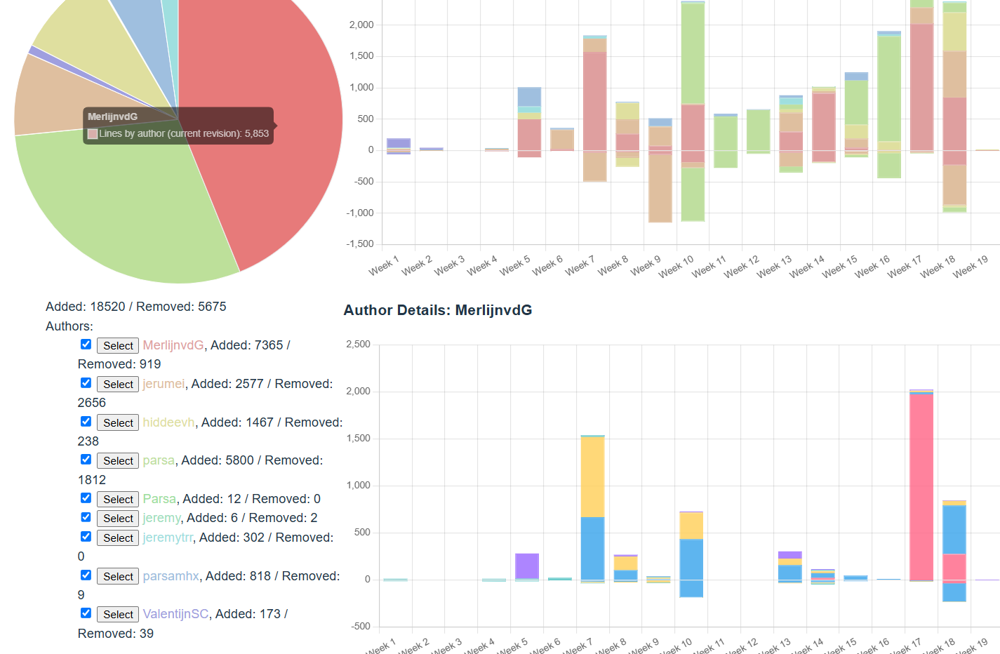

#  Sprint 1

## Stats

Toeliching Week 15 & 16...

## Zelfbeoordeling
* Backend Code Kwantiteit - Op Niveau
Want zoals je ziet Link X...blabla

* Backend Code - Kwaliteit
    * Domeinmodel
    * Architectural Compliance
    * Datamodel
    * Restful Endpoints
    * Framework-gebruik

* Productie Deployment
Geen deployment gedaan, want de andere backender kon dit veel beter.

* Tevredenheid Team
...samenwerking
    * Ben ik tevreden over mijn functioneren in het team
    * Ben ik tevreden over hoe mijn team functioneert? (geen naming & shaming plx.)
    * Is mijn team tevreden over mij?

* Tevredenheid Opdrachtgever
...heeft het echt waarde opgeleverd?
    * Ben ik tevreden over hoe de opdrachtgever met ons omgaat?
    * Is de opdrachtgever tevreden over ons functioneren? 
    24 * 3 * 20 * tg = 1440 * tg

    

