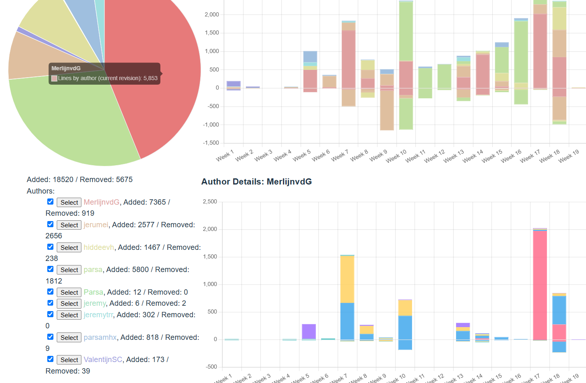

#  Sprint 1

## Stats

## Zelfbeoordeling
* Backend Code Kwantiteit - Op Niveau
Want zoals je ziet Link X...blabla

* Backend Code - Kwaliteit
    * Domeinmodel
    * Architectural Compliance
    * Datamodel
    * Restful Endpoints
    * Framework-gebruik

* Productie Deployment
Geen deployment gedaan, want de andere backender kon dit veel beter.

* Tevredenheid Team
...samenwerking

* Tevredenheid Opdrachtgever
...heeft het echt waarde opgeleverd?

